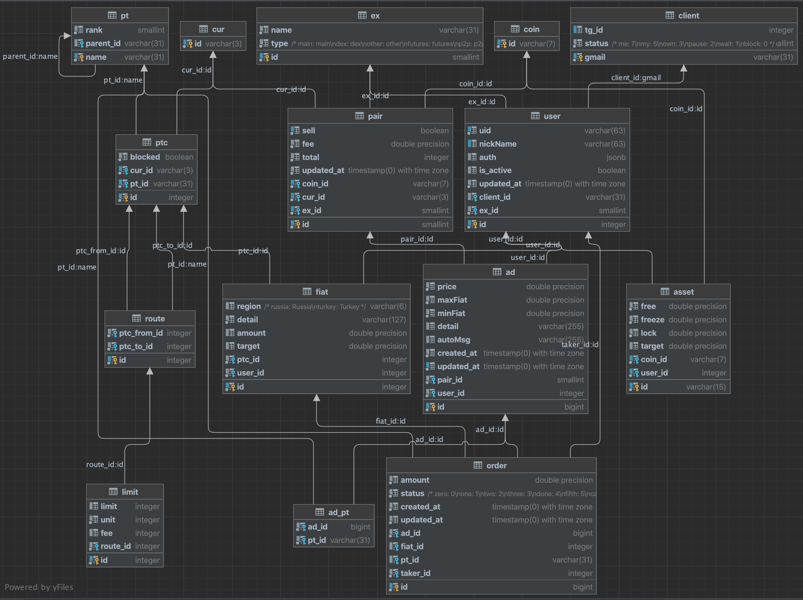

### Install
```sh
pip install -U -r requirements.txt
```

### Init
```sh
python init.py
```

### Api start
```sh
python main.py
```

### Daily actualize
1) Auths update for each client from chrome ext, and set correct `client.status`
2) ```python daily.py```
3) Manual check and fix (if need) your fiat asset amounts and targets in `fiat.amount`, `fiat.target`

### Watchdog run
```sh
python cycle.py
```

### Schema

